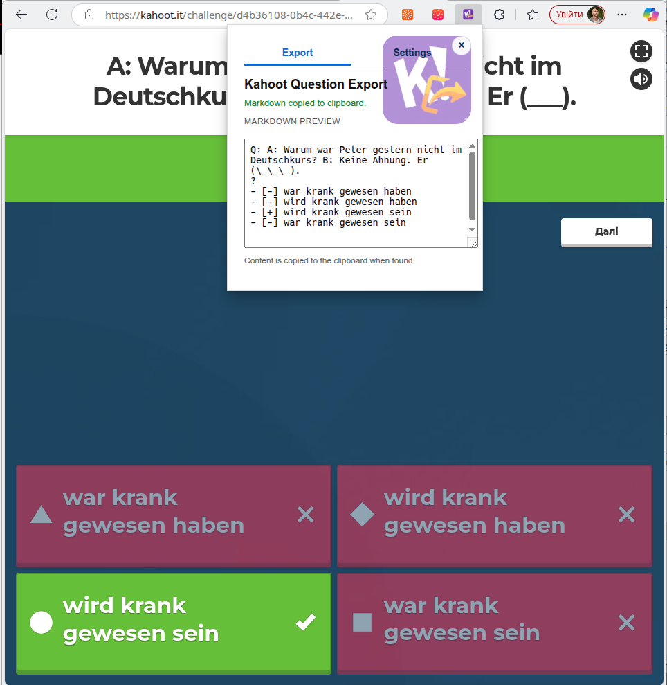
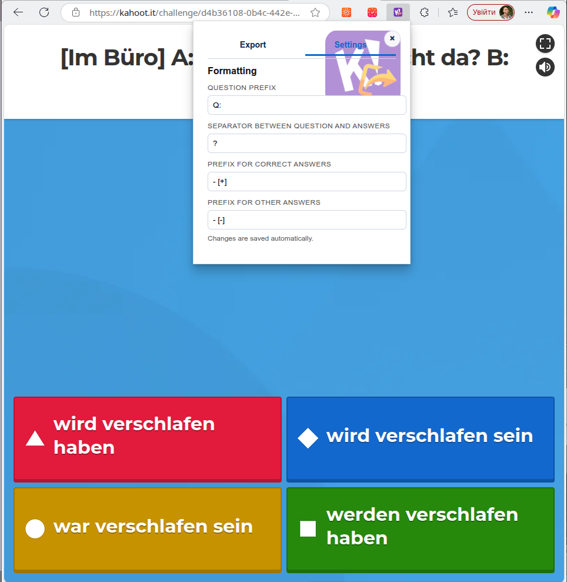
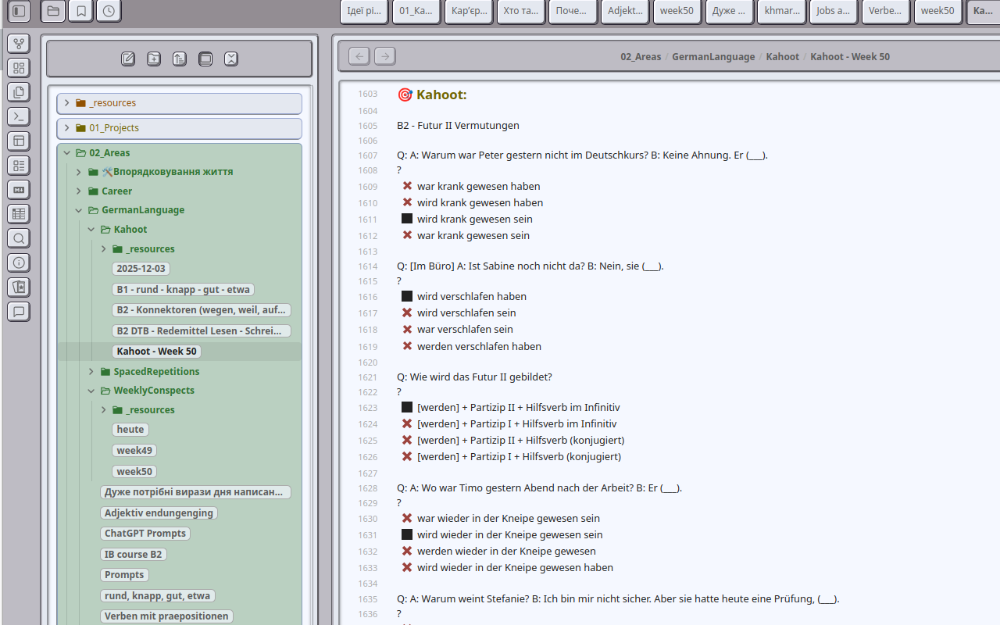

# Kahoot Question Exporter

A Chrome extension that grabs the currently visible Kahoot question and answers, formats them as Markdown, and copies the result to your clipboard automatically. Correct answers are marked with a configurable prefix (default `+`), while other options use a separate prefix (default `-`).

## Screenshots
&nbsp;

## My Usage

Primarily, I use this extension to export all questions from my German class tests into Obsidian Markdown (see the following screenshot) and review them one or more times. Additionally, one of the Obsidian spaced-repetition plugins can be used for further practice.

## Features

- Auto-scrapes the current Kahoot question and answers when you open the popup.
- Marks correct answers (after a question is answered) and prefixes them with `+` by default; other answers use `-` by default.
- Supports multiple-choice and open-ended Kahoot question types; skips score/count indicators.
- Supports jumble/word-order draggable jumble cards.
- Escapes Markdown-sensitive characters and deduplicates answers to keep exports clean.
- Saves formatting preferences (question prefix, separator, correct/incorrect prefixes) in Chrome sync storage.

## Installation (development mode)

1. Clone or download this repository.
2. In Chrome, open `chrome://extensions`.
3. Toggle **Developer mode** on.
4. Click **Load unpacked** and select the `kahoot-export-current-question-chrome-extension` directory.

## Usage

1. Open a Kahoot question page in your browser.
2. Click the extension icon. The popup runs immediately; if it finds the question and answers, it copies the Markdown to the clipboard and shows a preview.
3. Paste the Markdown wherever you need it. If you want to retry, press **Copy current question** in the popup.

## Settings

- **Question prefix**: Added before the question line (default `### `).
- **Separator**: Line placed between the question and answers (default `?`).
- **Prefix for correct answers**: Marker for correct options (default `+`).
- **Prefix for other answers**: Marker for remaining options (default `-`).

Settings save automatically and are used in both the preview and clipboard output.

## Permissions and privacy

- Requires `activeTab` and `scripting` to read the current page’s question/answers when you open the popup.
- No data leaves your browser; everything stays in the popup and clipboard.

## Troubleshooting

- If nothing appears, ensure the Kahoot question is visible on the page, then click **Copy current question** again.
- For open-ended questions, only the actual correct text is exported—score/count badges are ignored.

## Important

- The **Kahoot-export-current-question** Chrome extension is **not affiliated with, endorsed by, or associated with** Kahoot! or its services. *Kahoot!* and the *K!* logo are trademarks of **Kahoot! AS**.
- This extension is **developed solely for educational purposes**. Its primary goal is to help users review and relearn test questions in order to improve learning outcomes. The author assumes **no responsibility for copyright or other legal violations** resulting from its use.

